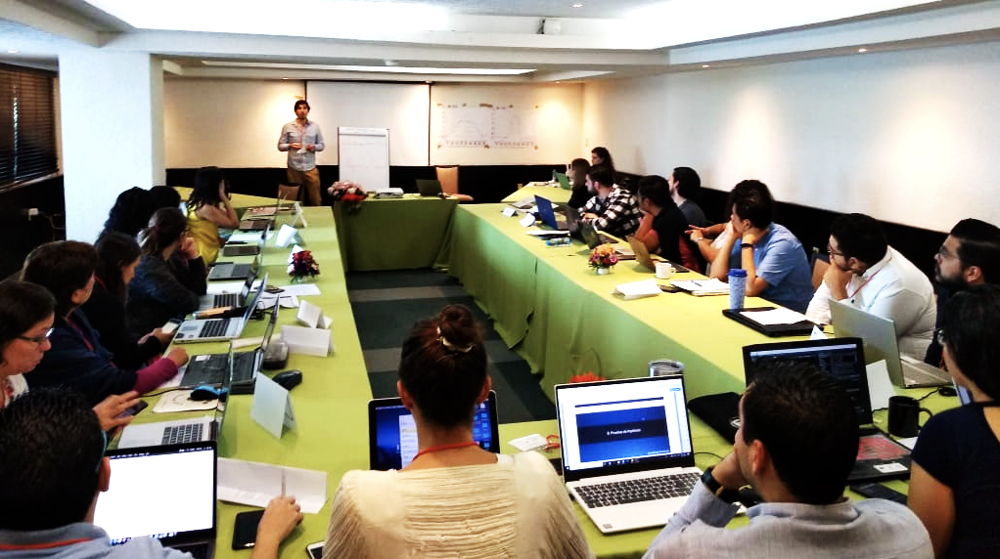

# Harvard Biostatistics Courses

I have worked as a **Teaching Assistant** at the Harvard T.H. Chan School of Public Health for Statistical Learning, Data Science II (Deep Learning course), Introductory Genomics & Bioinformatics for Health Research, Applied Regression Analysis, and Practice and Culminating Experience for Quantitative Methods.  These courses are available for students in several departments at the school, they cover a wide range of applied and theoretical statistics and machine learning content. 

# Data Science in Action: Machine Learning for Self-Driving Cars

Additionally, with the help of great collaborators and my advisor Tianxi Cai, we created the **[Data Science in Action: Machine Learning for Self-Driving Cars](https://www.hsph.harvard.edu/biostatistics/machine-learning-for-self-driving-cars/)** course, this is a 10-day course to introduce programming and machine learning to high school students. The culminating project is to program convolutional neural networks and implement them in a self driving toy car. We have taught this course two years in a row now (2019 & 2020).

# Reinforcement Learning summer school

During the 2019 summer I taught a **[Reinforcement Learning summer school](https://github.com/asonabend/RL_with_OpenAI)** at the [International Meeting of Artificial Intelligence and Its Applications](https://riiaa.org/), the biggest Artificial Intelligence conference in Mexico. We covered the basic concepts of reinforcement learning, $Q$-learning and programmed agents to play [OpenAI](https://gym.openai.com/) basic environments.

# Biostatistical course

{: style="float: left; margin-right: 1em;"}

I participated in the [Global Initiative for Neuropsychiatric Genetics Education in Research](https://ginger.sph.harvard.edu/) during 2020 winter, this is a **biostatistical training course** run in collaboration with [NeuroMex](https://ginger.sph.harvard.edu/2020/02/11/ginger-on-site-training-in-campeche-mexico-january-2019/) in Mexico. This course is designed to introduce fundamental statistical and epidemiological concepts to Mexican researchers performing GWAS studies in collaboration with the [Broad institute of MIT & Harvard](https://www.broadinstitute.org/).

# Artificial Intelligence

I also participated at [Clubes de Ciencia Mexico](https://www.clubesdeciencia.org/) where I paired up with an engineer to teach a course for Mexican undergraduate students on [artificial intelligence and electrical engineering](https://www.clubesdeciencia.mx/estudiantes/clubes2018/)

